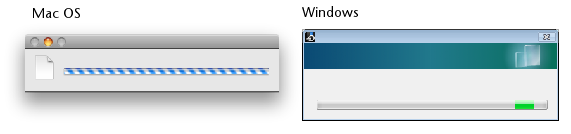

# 4D Progress

This component lets you open one or more progress bars in the same window.

Each progress bar is assigned an ID that is generated automatically by the [Progress New](Documentation/Methods/Progress%20New.md) method. This ID is used by all the project methods of the component to manage the properties and values in progress dialog boxes.

[Online documentation](https://doc.4d.com/4Dv20/4D/20/4D-Progress.100-6341911.en.html)

## Available commands

- [Progress Get Button Enabled](Documentation/Methods/Progress%20Get%20Button%20Enabled.md)
- [Progress Get Button Title](Documentation/Methods/Progress%20Get%20Button%20Title.md)
- [Progress Get Icon](Documentation/Methods/Progress%20Get%20Icon.md)
- [Progress Get Message](Documentation/Methods/Progress%20Get%20Message.md)
- [Progress Get On Error Method](Documentation/Methods/Progress%20Get%20Error%20Method.md)
- [Progress Get On Stop Method](Documentation/Methods/Progress%20Get%20Stop%20Method.md)
- [Progress Get Progress](Documentation/Methods/Progress%20Get%20Progress.md)
- [Progress Get Title](Documentation/Methods/Progress%20Get%20Title.md)
- [Progress New](Documentation/Methods/Progress%20New.md)
- [Progress QUIT](Documentation/Methods/Progress%20QUIT.md)
- [Progress SET BUTTON ENABLED](Documentation/Methods/Progress%20SET%20BUTTON%20ENABLED.md)
- [Progress SET BUTTON TITLE](Documentation/Methods/Progress%20SET%20BUTTON%20TITLE.md)
- [Progress SET FONT SIZES](Documentation/Methods/Progress%20SET%20FONT%20SIZES.md)
- [Progress SET FONTS](Documentation/Methods/Progress%20SET%20FONTS.md)
- [Progress SET ICON](Documentation/Methods/Progress%20SET%20ICON.md)
- [Progress SET MESSAGE](Documentation/Methods/Progress%20SET%20MESSAGE.md)
- [Progress SET ON ERROR METHOD](Documentation/Methods/Progress%20SET%20ON%20ERROR%20METHOD.md)
- [Progress SET ON STOP METHOD](Documentation/Methods/Progress%20SET%20ON%20STOP%20METHOD.md)
- [Progress SET PROGRESS](Documentation/Methods/Progress%20SET%20PROGRESS.md)
- [Progress SET TITLE](Documentation/Methods/Progress%20SET%20TITLE.md)
- [Progress SET WINDOW VISIBLE](Documentation/Methods/Progress%20SET%20WINDOW%20VISIBLE.md)
- [Progress Stopped](Documentation/Methods/Progress%20Stopped.md)

